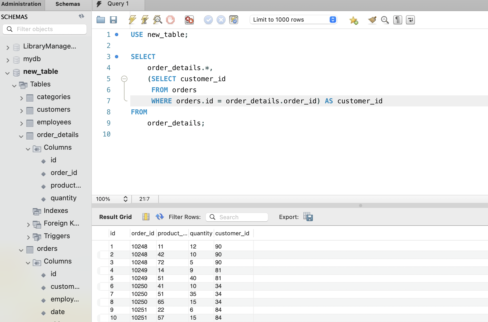
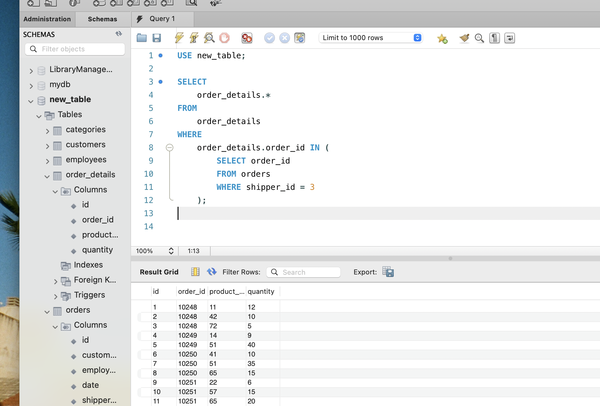
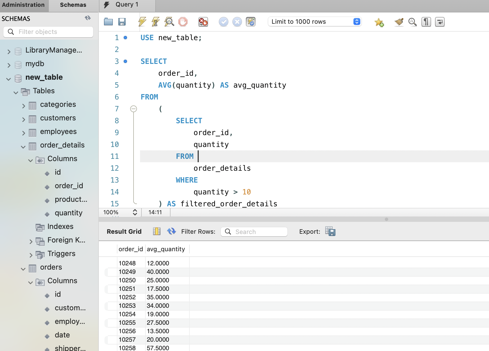
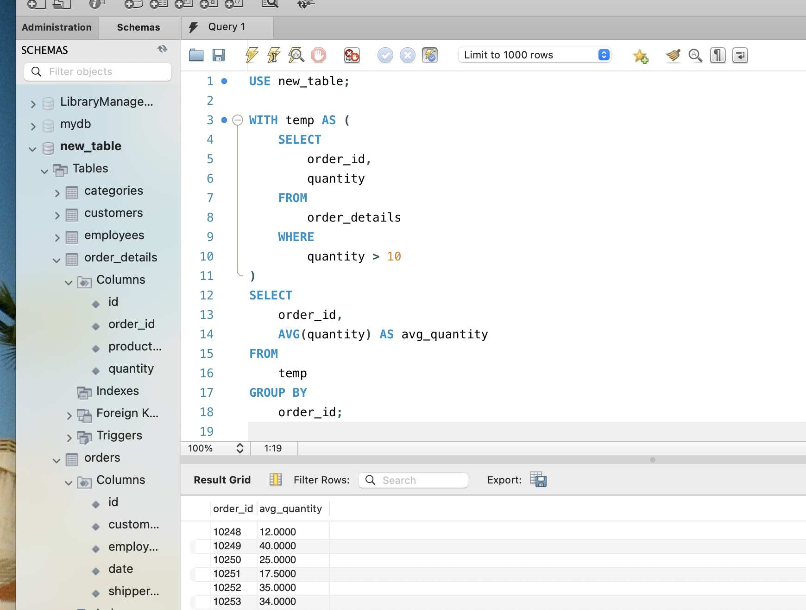
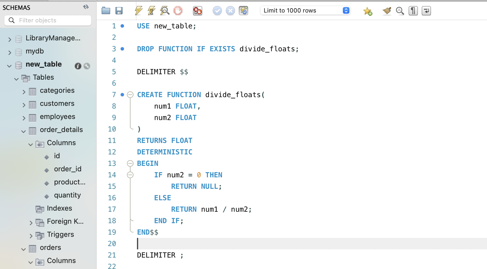
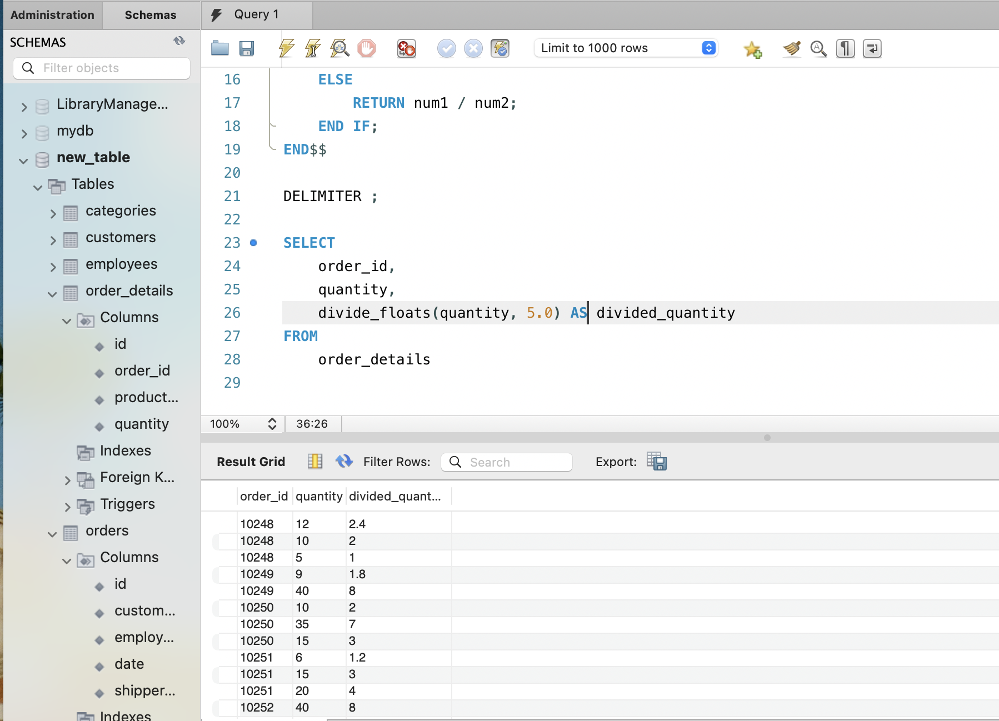

1. Напишіть SQL запит, який буде відображати таблицю order_details та поле customer_id з таблиці orders відповідно для кожного поля запису з таблиці order_details.

Це має бути зроблено за допомогою вкладеного запиту в операторі SELECT.

**Рішення**

```sql
USE new_table;

SELECT
    order_details.*,
    (SELECT customer_id
     FROM orders
     WHERE orders.id = order_details.order_id) AS customer_id
FROM
    order_details;
```



2. Напишіть SQL запит, який буде відображати таблицю order_details. Відфільтруйте результати так, щоб відповідний запис із таблиці orders виконував умову shipper_id=3.

Це має бути зроблено за допомогою вкладеного запиту в операторі WHERE.

**Рішення**

```sql
USE new_table;

SELECT
    order_details.*
FROM
    order_details
WHERE
    order_details.order_id IN (
        SELECT order_id
        FROM orders
        WHERE shipper_id = 3
    );

```



3. Напишіть SQL запит, вкладений в операторі FROM, який буде обирати рядки з умовою quantity>10 з таблиці order_details. Для отриманих даних знайдіть середнє значення поля quantity — групувати слід за order_id.

**Рішення**

```sql
USE new_table;

SELECT
    order_id,
    AVG(quantity) AS avg_quantity
FROM
    (
        SELECT
            order_id,
            quantity
        FROM
            order_details
        WHERE
            quantity > 10
    ) AS filtered_order_details
GROUP BY
    order_id;

```



4. Розв’яжіть завдання 3, використовуючи оператор WITH для створення тимчасової таблиці temp. Якщо ваша версія MySQL більш рання, ніж 8.0, створіть цей запит за аналогією до того, як це зроблено в конспекті.

**Рішення**

```sql
USE new_table;

WITH temp AS (
    SELECT
        order_id,
        quantity
    FROM
        order_details
    WHERE
        quantity > 10
)
SELECT
    order_id,
    AVG(quantity) AS avg_quantity
FROM
    temp
GROUP BY
    order_id;

```



5. Створіть функцію з двома параметрами, яка буде ділити перший параметр на другий. Обидва параметри та значення, що повертається, повинні мати тип FLOAT.

Використайте конструкцію DROP FUNCTION IF EXISTS. Застосуйте функцію до атрибута quantity таблиці order_details . Другим параметром може бути довільне число на ваш розсуд.

**Рішення**

```sql
DROP FUNCTION IF EXISTS divide_floats;

DELIMITER $$

CREATE FUNCTION divide_floats(
num1 FLOAT,
num2 FLOAT
)
RETURNS FLOAT
DETERMINISTIC
BEGIN
IF num2 = 0 THEN
RETURN NULL;
ELSE
RETURN num1 / num2;
END IF;
END$$

DELIMITER ;

```

**Використання**

```sql
SELECT
    order_id,
    quantity,
    divide_floats(quantity, 5.0) AS divided_quantity
FROM
    order_details;
```



